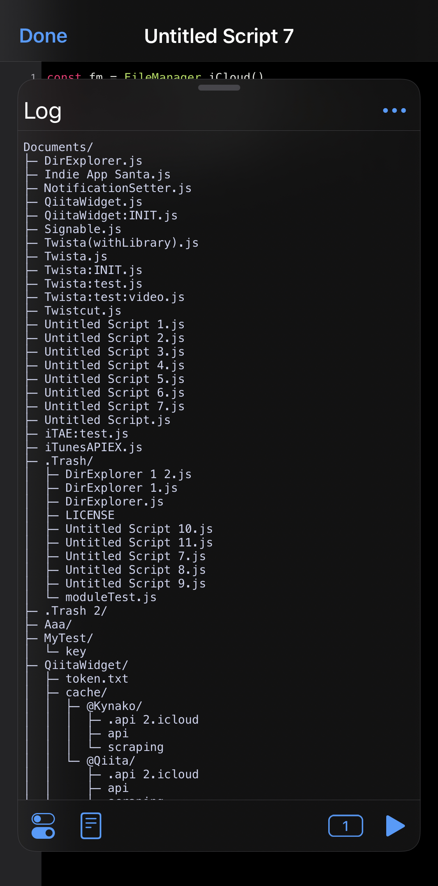

# DirExplorer
Generate objects that expresses Directory, or "Directory Tree"

# Overview


# Usage
```javascript
// root path
const fm = FileManager.iCloud()
const root = fm.documentDirectory()

const direx = new DirExplorer()
let data = direx.process(root)
direx.tree(data, true)
```

# Requiement 
- [Scriptable](https://scriptable.app/) 1.6.3

# Feauture
- 📁 Get directories's structured data from a path
- 🌳 Generate directory tree

# Reference
## `direx.process()`
**`process()`** method returns structured directories object from path given as root.

### Syntax
```javascript
let data = direx.process(path);
```

### Parameters
- **`path`**
  - the path for analizing directory.

### Returns value
Structured directories/files object.

- **`isDir`**
  - Wheather it is a directory.
- **`path`**
  - The file/directory path.
- **`hierarky`**
  - A number that represents the hierarchy of items.
  - Root’s hierarky is 0.
- **`contents`**
  - The contents that the item has.

### Data model
```javascript
// let fm = FileManager.iCloud()
// let data = direx.process(fm.DocumentDirectory())
// console.log(JSON.stringify(data, null, 2))
[
  {
    isDir: true,
    path: "/private/var/mobile/Library/Mobile Documents/iCloud~dk~simonbs~Scriptable/Documents/",
    name: "Documents",
    hierarky: 0,
    contents: [
      {
        isDir: false,
        path: "/private/var/mobile/Library/Mobile Documents/iCloud~dk~simonbs~Scriptable/Documents/DirExplorer.js",
        name: "DirExplorer.js",
        hierarky: 1,
        contents: null
      },
      {
        ...
      }
    ]
  }
]
```

## **`direx.tree()`**
**`tree()`** method generates directory tree string from data that is from **`process()`**.

### Syntex
```javascript
let tree = direx.tree(data, present?);
```

### Parameters
- **`data`**
  - The data from generated by **`process()`**
- **`present`**
  - Wheather to automatically output to console.
  - Default is false.

# License
[MIT license](/LICENSE)
